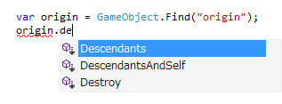

LINQ to GameObject
===
LINQ to GameObject is GameObject extensions for Unity that allows traverse hierarchy like LINQ to XML.

Axis
---
The concept of LINQ to GameObject is axis on tree.


Every traverse method returns `IEnumerable<GameObject>` and deferred exectuion. For example

```csharp
origin.Ancestors();   // Container, Root
origin.Children();    // Sphere_A, Sphere_B, Group, Sphere_A, Sphere_B
origin.Descendants(); // Sphere_A, Sphere_B, Group, P1, Group, Sphere_B, P2, Sphere_A, Sphere_B
origin.ObjectsBeforeSelf(); // C1, C2
origin.ObjectsAfterSelf();  // C3, C4
```

You can chain query(LINQ to Objects) and use some specified methods(Destroy, OfComponent and others).

```csharp
// destroy all filtered(tag == "foobar") objects
root.Descendants().Where(x => x.tag == "foobar").Destroy();

// destroy all cloned objects
origin.transform.root.gameObject
    .Descendants()
    .Where(x => x.name.EndsWith("(Clone)"))
    .Destroy();

// get FooScript under self childer objects and self
var fooScripts = root.ChildrenAndSelf().OfComponent<FooScript>(); 
```

How to use
---
Import LINQ to GameObject from Unity Asset Store(currenly under reviewing!) or copy [Assets/LINQtoGameObject/Scripts/LINQtoGameObject](https://github.com/neuecc/LINQ-to-GameObject-for-Unity/tree/master/Assets/LINQtoGameObject/Scripts).

All methods are extension of GameObject, using `Unity.Linq` then you can use all extension methods.

```csharp
using Unity.Linq;
```


Operate
---
LINQ to GameObject have several operate methods, append child(`Add`, `AddFirst`, `AddBeforeSelf`, `AddAfterSelf`) and destroy object(`Destroy`).

```csharp
var root = GameObject.Find("root"); 
var cube = Resources.Load("Prefabs/PrefabCube") as GameObject; 

// add do attach parent, set same layer and fix localPosition/Scale/Rotation.
// added child is cloned and returns child object.
var clone = root.Add(cube);

// choose sibling position and allow append multiple objects.
var clones = root.AddAfterSelf(new[] { cube, cube, cube });  

// destroy do check null and deactive/detouch before destroy. It's more safety.
root.Destroy();
```

Operate methods are extension methods of GameObject, too. You need `using Unity.Linq`.

Functional Construction
---
GameObjectBuilder construct tree use functional construction pattern.

```csharp
var cube = Resources.Load("Prefabs/PrefabCube") as GameObject;

var tree = 
    new GameObjectBuilder(cube,
        new GameObjectBuilder(cube),
        new GameObjectBuilder(cube,
            new GameObjectBuilder(cube)),
        new GameObjectBuilder(cube));

var root = tree.Instantiate();
```

More info, see [Functional Construction (LINQ to XML)](http://msdn.microsoft.com/en-us/library/bb387019.aspx).

Reference
---
All traverse methods can find inactive object. If not found return type is `GameObject` methods return null, return type is `IEnumerable<GameObject>` methods return empty sequence. All collection methods have `string name` overload that returns filtered collection that have a matching name are included in the collection.

Method | Description 
-------| -----------
Parent|Gets the parent GameObject of this GameObject. If this GameObject has no parent, returns null.
Child|Gets the first child GameObject with the specified name. If there is no GameObject with the speficided name, returns null.
Children|Returns a collection of the child GameObjects.
ChildrenAndSelf|Returns a collection of GameObjects that contain this GameObject, and the child GameObjects.
Ancestors|Returns a collection of the ancestor GameObjects of this GameObject.
AncestorsAndSelf|Returns a collection of GameObjects that contain this element, and the ancestors of this GameObject.
Descendants|Returns a collection of the descendant GameObjects.
DescendantsAndSelf|Returns a collection of GameObjects that contain this GameObject, and all descendant GameObjects of this GameObject.
ObjectsBeforeSelf|Returns a collection of the sibling GameObjects before this GameObject.
ObjectsBeforeSelfAndSelf|Returns a collection of GameObjects that contain this GameObject, and the sibling GameObjects before this GameObject.
ObjectsAfterSelf|Returns a collection of the sibling GameObjects after this GameObject.
ObjectsAfterSelfAndSelf|Returns a collection of GameObjects that contain this GameObject, and the sibling GameObjects after this GameObject.

Operate methods have three optional parameter. `cloneType` configure cloned child GameObject's localPosition/Scale/Rotation. `setActive` configure activates/deactivates child GameObject. If null, doesn't set specified value. `specifiedName` configure set name of child GameObject. If null, doesn't set specified value.

Method | Description 
-------| -----------
Add|Adds the GameObject as children of this GameObject. Target is cloned.
AddFirst|Adds the GameObject as the first children of this GameObject. Target is cloned.
AddBeforeSelf|Adds the GameObject before this GameObject. Target is cloned.
AddAfterSelf|Adds the GameObject after this GameObject. Target is cloned.
Destroy|Destroy this GameObject safety(check null, deactive/detouch before destroy).

There are `TransformCloneType` that used Add methods.

Value|Description
-------| -----------
KeepOriginal|Set to same as Original. This is default of Add methods.
FollowParent|Set to same as Parent.
Origin|Set to Position = zero, Scale = one, Rotation = identity.
DoNothing|Position/Scale/Rotation as is.        

`IEnumerable<GameObject>` Extensions.

Method|Description
-------|-----------
Ancestors|Returns a collection of GameObjects that contains the ancestors of every GameObject in the source collection.
AncestorsAndSelf|Returns a collection of GameObjects that contains every GameObject in the source collection, and the ancestors of every GameObject in the source collection.
Descendants|Returns a collection of GameObjects that contains the descendant GameObjects of every GameObject in the source collection.
DescendantsAndSelf|Returns a collection of GameObjects that contains every GameObject in the source collection, and the descendent GameObjects of every GameObject in the source collection.
Children|Returns a filtered collection of the child GameObjects of every GameObject in the source collection. Only GameObjects that have a matching name are included in the collection.
ChildrenAndSelf|Returns a collection of GameObjects that contains every GameObject in the source collection, and the child GameObjects of every GameObject in the source collection.
Destroy|Destroy every GameObject in the source collection safety(check null, deactive/detouch before destroy).
OfComponent|Returns a collection of specified component in the source collection.

GameObjectBuilder.

Method | Description 
-------| -----------
Instantiate|Instantiate tree objects.

Author Info
---
Yoshifumi Kawai(a.k.a. neuecc) is software developer in Japan.  
He is Director/CTO at Grani, Inc.  
Grani is top social game developer in Japan.   
He awarded Microsoft MVP for Visual C# since 2011.  
He is known by creator of [linq.js](http://linqjs.codeplex.com/)(LINQ to Objects for JavaScript) and [UniRx](https://github.com/neuecc/UniRx)(Reactive Extensions for Unity)

Blog: http://neue.cc/ (JPN)  
Twitter: https://twitter.com/neuecc (JPN)

License
---
This library is under MIT License.